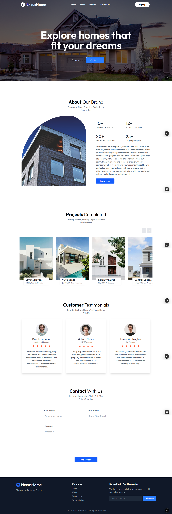

# 🏠 NexusHome - Real Estate Website

✨ **NexusHome** is a modern, fully responsive real estate web application built with **React JS** and **Tailwind CSS**. It showcases elegant UI, smooth UX, and interactive animations, creating a seamless experience for users exploring real estate projects.

---

## 🚀 Live Demo

🔗 [Live Demo](https://nexushome-realstate.vercel.app/)  
📂 [GitHub Repository](https://github.com/ankittripathe/RealEstate-App)

---

## 🎯 Features

- **🖼️ Animated Sections** – Smooth animations across Header, About, Projects, Testimonials & more using **Framer Motion**.
- **📱 Responsive Design** – Optimized for all devices with a mobile-friendly **hamburger navigation** and scroll lock.
- **🔄 Multi-page Navigation** – Implemented using **React Router DOM**.
- **📤 Contact Form Integration** – Easily submit messages via **Web3Forms**.
- **🔔 Toast Notifications** – User-friendly alerts with **React Toastify**.

---

## 🛠️ Tech Stack

- **React JS**
- **Tailwind CSS**
- **Framer Motion**
- **React Router DOM**
- **React Toastify**
- **Web3Forms**

---

## 📁 Folder Structure

```
📦 src
├── 📁 Components
│   ├── About.jsx
│   ├── Contact.jsx
│   ├── Footer.jsx
│   ├── Header.jsx
│   ├── LoginSignup.jsx
│   ├── Navbar.jsx
│   ├── Project.jsx
│   └── Testimonials.jsx
│
├── 📁 Pages
│   ├── AboutPage.jsx
│   ├── ContactPage.jsx
│   ├── HomePage.jsx
│   ├── LoginSignupPage.jsx
│   ├── ProjectPage.jsx
│   └── TestimonialPage.jsx
│
├── 📁 assets
│   └── assets.js
│
├── App.jsx
├── main.jsx
├── index.css
└── index.html
```

---

## 💡 What I Learned

While building NexusHome, I enhanced my understanding of:

- Designing **responsive user interfaces** using Tailwind CSS.
- Creating **smooth animations and transitions** with Framer Motion.
- Managing **client-side routing** using React Router DOM.
- **Integrating third-party APIs** like Web3Forms for form submissions.
- Providing **instant user feedback** through React Toastify.

---

## 📸 Screenshots

| Homepage | Projects | Contact |
|----------|----------|---------|
|  |  |  |

> 📁 Ensure you have the actual screenshots in a `/screenshots` folder and update file paths if needed.

---

## 📦 Getting Started

### Prerequisites

- Node.js (v14 or above)
- npm or yarn

---

## 🚀 How to Run the Project

```bash
# 1. Clone the repository
git clone https://github.com/ankittripathe/RealEstate-App.git
cd RealEstate-App

# 2. Install dependencies
npm install

# 3. Start the development server
npm run dev
```

---

## 🤝 Let's Connect

If you're passionate about frontend development, UI/UX, or React-based web apps — let’s connect and collaborate!

🔗 [LinkedIn](https://linkedin.com/in/ankittripathe)  
📧 ankittripathe@gmail.com

## 🌐 Check Out My Portfolio

🔗 [Visit My Developer Portfolio](https://ankittripathi.vercel.app/)


---

## 📄 License

This project is open-source and available under the [MIT License](LICENSE).

---